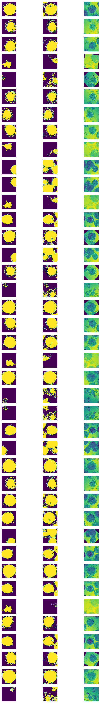

# Implementation of Unet(deep learning) using pytorch

---

## Overview

### Data

The dataset contains bimedical images and labels

### Data augmentation

The data contains 38 images(1024*1024) in total. So data augumentation techniques were used along with a non-rigid transformation technique to generate 
a few more samples for training.

### Model

### Training

The model is trained for 55 epochs.

Loss function for the training is crossentropy.

### Results

Use the trained model to do segmentation on test images, the result is statisfactory.
Target image **************** Predicted image ***************** Original image

